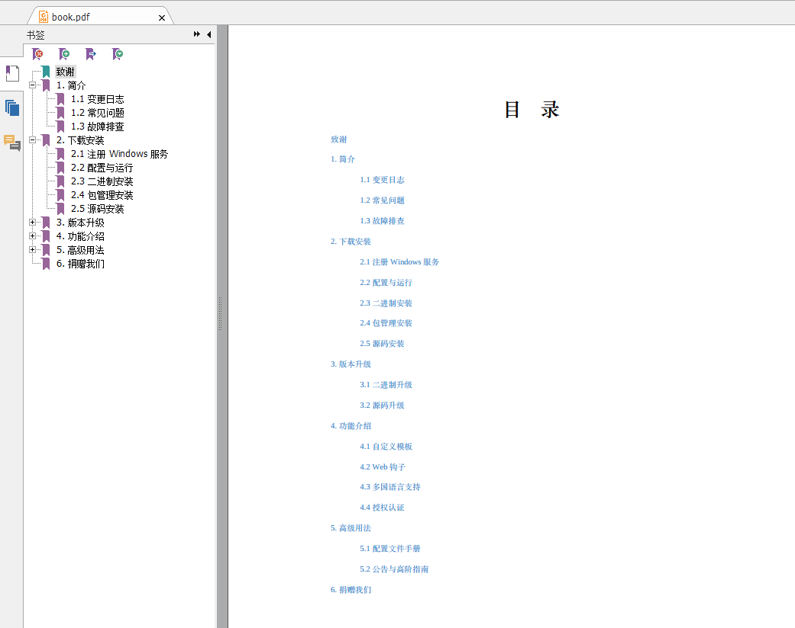

目录
- [缘由](#intro)
- [安装calibre](#intro)
- [文档导出效果](#effect)
- [快速体验](#quick)
- [使用案例](#example)
- [配置文件](#config)
	- [json配置示例](#config-example)
	- [json配置项说明](#config-statement)
- [使用教程](#tutorial)
	- [Go语言使用](#tutorial-go)
	- [其它语言](#tutorial-other)
- [原理](#principle)
- [注意事项](#attention)
- [精神上支持我](#support)
- [markdown文档如何转成pdf、epub、mobi](#markdown)

通过calibre，将markdown和html转成epub、mobi、pdf等格式文档。

> 说明(于2018-06-02)：calibre将HTML转成mobi等格式时请注意配置好各项配置参数到合理值，同时注意自己的HTML的样式调整，特别是在mobi格式的时候，html的CSS样式，如`background:#dddddd`设置背景色，颜色不生效，需要用`background-color:#dddddd`才会生效。
目前经过多次测试，生成文档效果不佳的问题，主要是配置参数如字体大小和CSS样式问题造成的。同时，为了方便在epub等阅读器上的阅读体验，可以将body标签的CSS背景色设置为透明。


<a name="intro"></a>
## 缘由

事情是这样的：我们公司 [掘金量化](https://www.myquant.cn)(跟[掘金](https://juejin.im)是`javascript`和`java`的关系) 让我开发公司官网，官网的帮助中心文档，需要生成pdf离线文档以方便用户阅读和使用，但是使用`wkhtmltopdf`生成PDF文档，效果不是很理想。

看着gitbook和看云生成的PDF文档，非常完美，然后把从两个站点下载的PDF文档的后缀改成了`.xml`格式，文本编辑器打开一看，用的居然是`calibre`，然后当时捣鼓了半个月，终于把问题解决。

感觉很多企业和个人可能也会有同样的需求，所以干脆将`calibre`的使用封装一下，开源出来，以方便更多的人。

> 当前文档，会告诉你使用方式和生成原理，以便你也可以根据自己掌握的编程语言封装一个工具类

<a name="install"></a>
## 安装calibre
- 下载地址：https://calibre-ebook.com/download
- 根据自己的系统安装对应的calibre（需要注意的是，calibre要安装3.x版本的，2.x版本的功能不是很强大。反正安装最新的就好。）
- 安装完calibre之后，将calibre加入到系统环境变量中，执行下面的命令之后显示3.x的版本即表示安装成功。
```
ebook-convert --version
```
<a name="effect"></a>
## 文档导出效果
案例使用的是无闻的《Gogs中文文档》，文档地址：https://www.bookstack.cn/books/gogs_zh ，可以访问该地址查看文档导出的实际效果。

截图：


<a name="quick"></a>
## 快速体验
如果成功安装了calibre，并配置了环境变量，则可以按照下面的方式进行快速体验。(bin目录下是各系统64位的二进制可执行程序，限64位系统)
- Windows用户，进入`bin/win`目录，执行命令：
```
./converter.exe ../../example/gogs_zh/config.json
```
- Mac用户，进入`bin/mac`目录，执行命令：
```
./converter ../../example/gogs_zh/config.json
```
- Linux用户，进入`bin/linux`目录，执行命令：
```
./converter ../../example/gogs_zh/config.json
```
执行成功之后，在`example/gogs_zh/output`下可以看到导出的文档

<a name="example"></a>
## 使用案例
- 掘金量化 https://www.myquant.cn (这是我们公司的官网，做量化投资的。戳进去，"帮助中心"里面可以看到文档导出效果)
- 书栈网(BookStack) https://www.bookstack.cn (基于MinDoc做的二次开发的站点，开源地址：https://github.com/TruthHun/BookStack)
- MinDoc  https://github.com/lifei6671/mindoc

<a name="config"></a>
## 配置文件
以json作为配置文件，配置文件的文件名不限制，在使用的时候指定一下配置文件的文件名即可。
需要注意的是，json配置文件需要放在项目的根目录下。比如示例项目，`example/gogz_zh`中，配置文件`config.json`就是放在项目的根目录

<a name="config-example"></a>
### json配置示例
```json
{
	"charset": "utf-8",
	"cover": "",
	"date": "2018-01-21",
	"description": "Gogs 的目标是打造一个最简单、最快速和最轻松的方式搭建自助 Git 服务。使用 Go 语言开发使得 Gogs 能够通过独立的二进制分发，并且支持 Go 语言支持的 所有平台，包括 Linux、Mac OS X、Windows 以及 ARM 平台。",
	"footer": "<p style='color:#8E8E8E;font-size:12px;'>本文档使用 <a href='http://www.bookstack.cn' style='text-decoration:none;color:#1abc9c;font-weight:bold;'>书栈(BookStack.CN)</a> 构建 <span style='float:right'>- _PAGENUM_ -</span></p>",
	"header": "<p style='color:#8E8E8E;font-size:12px;'>_SECTION_</p>",
	"identifier": "",
	"language": "zh-CN",
	"creator": "书栈(BookStack.CN)",
	"publisher": "书栈(BookStack.CN)",
	"contributor": "书栈(BookStack.CN)",
	"title": "Gogs中文文档",
	"format": ["epub", "mobi", "pdf"],
	"font_size": "14",
	"paper_size": "a4",
	"margin_left": "72",
	"margin_right": "72",
	"margin_top": "72",
	"margin_bottom": "72",
	"more": [],
	"toc": [{
		"id": 709800000,
		"link": "statement.html",
		"pid": 0,
		"title": "致谢"
	}, {
		"id": 539,
		"link": "539.html",
		"pid": 538,
		"title": "5.1 配置文件手册"
	}, {
		"id": 545,
		"link": "545.html",
		"pid": 543,
		"title": "4.1 自定义模板"
	}, {
		"id": 549,
		"link": "549.html",
		"pid": 548,
		"title": "2.1 注册 Windows 服务"
	}, {
		"id": 554,
		"link": "554.html",
		"pid": 0,
		"title": "1. 简介"
	}, {
		"id": 555,
		"link": "555.html",
		"pid": 554,
		"title": "1.1 变更日志"
	}, {
		"id": 540,
		"link": "540.html",
		"pid": 538,
		"title": "5.2 公告与高阶指南"
	}, {
		"id": 547,
		"link": "547.html",
		"pid": 543,
		"title": "4.2 Web 钩子"
	}, {
		"id": 548,
		"link": "548.html",
		"pid": 0,
		"title": "2. 下载安装"
	}, {
		"id": 556,
		"link": "556.html",
		"pid": 554,
		"title": "1.2 常见问题"
	}, {
		"id": 559,
		"link": "559.html",
		"pid": 558,
		"title": "3.1 二进制升级"
	}, {
		"id": 546,
		"link": "546.html",
		"pid": 543,
		"title": "4.3 多国语言支持"
	}, {
		"id": 550,
		"link": "550.html",
		"pid": 548,
		"title": "2.2 配置与运行"
	}, {
		"id": 557,
		"link": "557.html",
		"pid": 554,
		"title": "1.3 故障排查"
	}, {
		"id": 558,
		"link": "558.html",
		"pid": 0,
		"title": "3. 版本升级"
	}, {
		"id": 560,
		"link": "560.html",
		"pid": 558,
		"title": "3.2 源码升级"
	}, {
		"id": 543,
		"link": "543.html",
		"pid": 0,
		"title": "4. 功能介绍"
	}, {
		"id": 544,
		"link": "544.html",
		"pid": 543,
		"title": "4.4 授权认证"
	}, {
		"id": 551,
		"link": "551.html",
		"pid": 548,
		"title": "2.3 二进制安装"
	}, {
		"id": 538,
		"link": "538.html",
		"pid": 0,
		"title": "5. 高级用法"
	}, {
		"id": 552,
		"link": "552.html",
		"pid": 548,
		"title": "2.4 包管理安装"
	}, {
		"id": 542,
		"link": "542.html",
		"pid": 0,
		"title": "6. 捐赠我们"
	}, {
		"id": 553,
		"link": "553.html",
		"pid": 548,
		"title": "2.5 源码安装"
	}]
}
```

<a name="config-statement"></a>
### json配置项说明
- `charset` 指定字符集，留空则默认为utf-8编码。选填。
- `cover` 封面图片，一张`800x1068`像素或该尺寸比例的图片，jpg、png或gif格式。如果没有封面，请置空。选填。
- `date` 文档生成日期，年月日时分秒都可以。默认当前日期时间。选填。
- `title`  文档标题。必填。
- `description` 文档描述、摘要。选填。
- `footer`、`header` 生成PDF文档时，文档的底部(footer)和顶部(header)内容，仅对PDF文档有效。选填。
- `identifier` 出版物的标识。留空即可。
- `language`    语言。必填。可选值：zh、en、zh-CN、en-US等。
- `creator`、`publisher`、`contributor`   如果你懒的话，三个都传同一个值，比如示例中的"书栈(BookStack.CN)"。如果真要区分的话，`creator`就是文档作者，比如"进击的皇虫"，`publisher`、`contributor`理解为出版单位和构建人。三个配置项，建议填写。
- `format`  导出的文档格式，不传值则默认导出PDF。可选值：epub、pdf、mobi。
- `font_size` 数字，默认字体大小，仅对导出PDF有效。选填。
- `paper_size` 导出文档的页面大小，不区分大小写。默认"A4"，选填。可选值： `a0`, `a1`, `a2`, `a3`, `a4`, `a5`, `a6`, `b0`, `b1`, `b2`, `b3`, `b4`,`b5`, `b6`, `legal`, `letter`
- `margin_left`、`margin_right`、`margin_top`、`margin_bottom`  数字，左边距、右边距、上边距、下边距，仅对PDF文档有效。选填，默认72，即表示72pt。
- `more`    更多选项。仅对PDF有效。不建议使用。
- `toc` 重要！！！这个是重中之重，用于生成文档目录的。`id`、`pid`是数字，`pid`表示上级的id。id的值不能重复。`link`表示html链接文件。toc里面的`title`表示目录章节标题。

(参照示例的`config.json`去配置就好。)

<a name="tutorial"></a>
## 使用教程
bin目录下的是当前程序生成的64位的二进制可执行文件。Windows下使用示例：
```
converter.exe path/to/config.json
```
执行成功之后，会自动在项目目录下创建个`output`文件夹，并将文件导出到里面。比如导出pdf格式，则会在`output`文件夹下面出现`book.pdf`文件。

<a name="tutorial-go"></a>
### Go语言使用
引入当前包：
`github.com/TruthHun/converter/converter`
```golang
if Convert, err:= converter.NewConverter("path/to/config.json");err==nil{
    Convert.Convert()
}
```

<a name="tutorial-other"></a>
### 其它语言
由于目前没封装PHP、Python等的类和包，所以其它语言要使用的话，就是在项目下生成一个config.json(名字随便自己定义)，然后调用各自语言的cmd执行：
```
/path/to/converter /path/to/config.json
```
<a name="principle"></a>
## 原理
HTML导出PDF、epub等文档的原理很简单：根据config.json中的内容，生成epub电子书的基本结构，然后将当前目录下的文件压缩并重命名如`content.epub`，然后再使用`ebook-convert`进行转换，转换命令：
```
ebook-convert content.epub output/book.pdf [options]
```
这样，你就可以使用自己熟悉的语言封装一个包，并调用calibre导出文档了。


<a name="attention"></a>
## 注意事项
- HTML中不要有使用js代码渲染文档内容，因为js是不会被执行的

<a name="support"></a>
## 精神上支持我
虽然我很缺钱...
但是得到他人的肯定和认可比什么都重要。
如果当前项目帮到了你，请给项目一个star，以鼓励我在开源的路上能走的更好、更远。
附自己业余时间搞的一些站点，支持我，可以点击访问一下：
- IT文库  http://wenku.it
- 书栈(BookStack) http://www.bookstack.cn

<a name="markdown"></a>
## markdown文档如何转成pdf、epub、mobi
说实话，这个我没仔细去研究过。思路就是将markdown文档转成HTML(毕竟这样比较好控制显示样式)，然后再通过当前工具再转成PDF文档等。网上应该有更好的方法，如果大家找到了，麻烦也分享一下。


